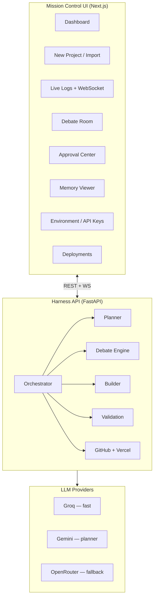
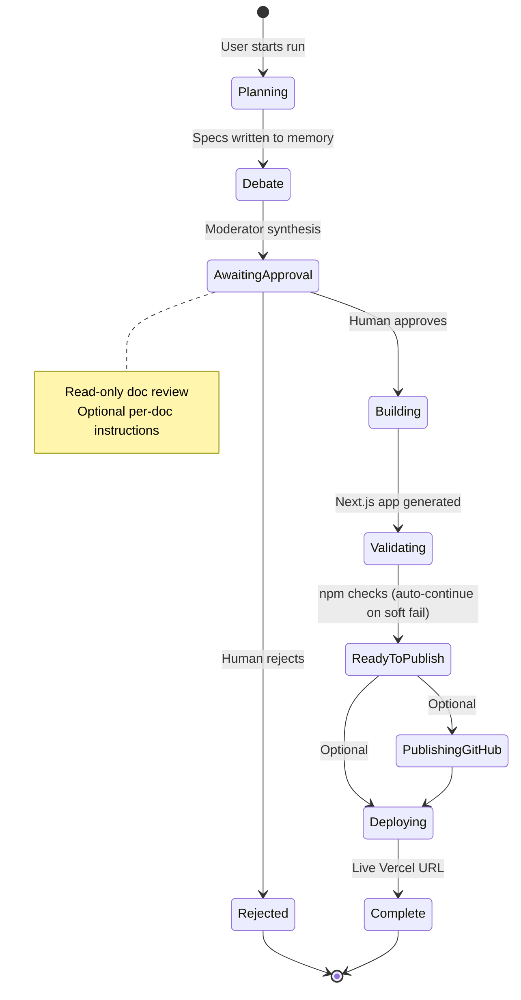
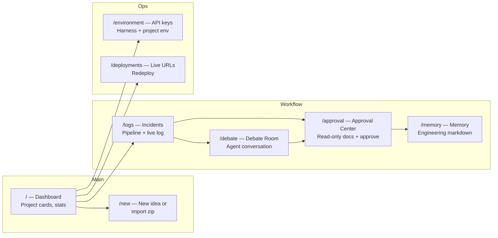
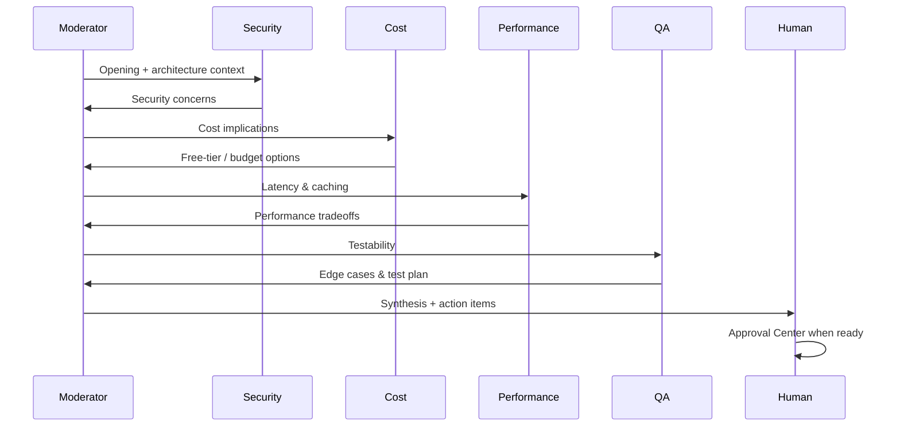
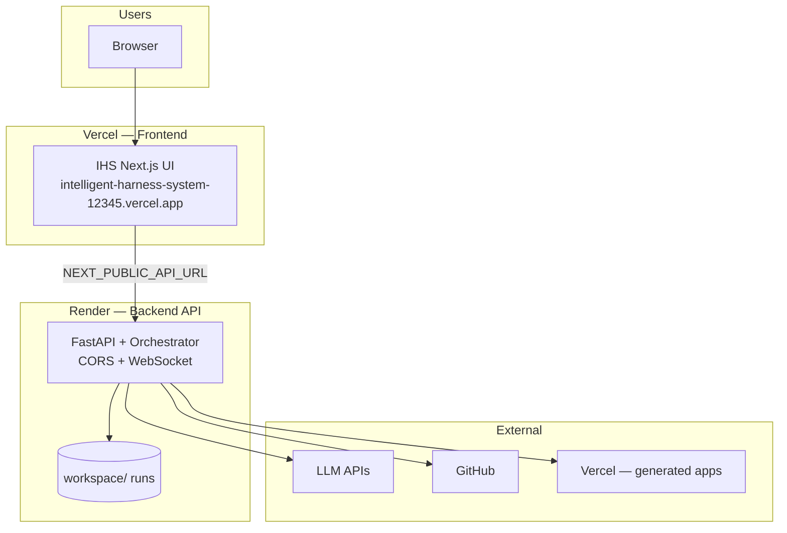

# Intelligent Harness System (IHS)

**Autonomous engineering harness** — plan, debate, approve, build, validate, and publish software projects with human oversight at critical gates.

| | |
|---|---|
| **Live application** | [https://intelligent-harness-system-12345.vercel.app/](https://intelligent-harness-system-12345.vercel.app/) |
| **API (Render)** | [https://intelligent-harness-system.onrender.com](https://intelligent-harness-system.onrender.com) |
| **Source code** | [https://github.com/anshumankansana/Intelligent-Harness-System](https://github.com/anshumankansana/Intelligent-Harness-System) |
| **Version** | 0.1.0 (hackathon MVP) |

---

## Executive summary

The **Intelligent Harness System (IHS)** is not a chatbot. It is a **workflow engine** that takes a product idea (typed text or a Word `.docx` brief), runs a structured engineering pipeline, and produces a deployable Next.js application—with **live logs**, **multi-agent debate**, **human approval**, and optional **GitHub + Vercel** publishing.

The system is built for hackathon demos and real iteration: multiple LLM providers (Groq, Gemini, OpenRouter) with **automatic fallback**, a mission-control style UI, and guardrails so humans stay in control before code is generated and shipped.

---

## What we built

### Platform components



| Layer | Technology | Role |
|-------|------------|------|
| Frontend | Next.js 14, React, Zustand, Tailwind | Dashboard, real-time logs, approval UX |
| Backend | FastAPI, Python 3.11+ | Pipeline orchestration, WebSockets, file workspace |
| AI | Groq, Gemini, OpenRouter | Planning, debate, code generation with auto-failover |
| Deploy | Vercel (UI), Render-ready (API) | Production hosting |
| Artifacts | Markdown memory, generated Next.js apps | Per-run engineering docs + built code |

---

## End-to-end pipeline

Each **run** moves through deterministic stages. Progress and stage labels sync to the UI in real time.



### Stage reference

| Stage | What happens |
|-------|----------------|
| **Planning** | LLM writes `PROJECT_SPEC`, `TASKS`, `ARCHITECTURE`, `DECISIONS`, `RISKS`, `TEST_PLAN` into run memory |
| **Debate** | Security, cost, performance, and QA agents discuss the architecture live (WebSocket events) |
| **Awaiting approval** | Human reviews documents, adds optional instructions per doc, approves or rejects |
| **Building** | Builder generates a small Next.js app from approved memory |
| **Validating** | `npm install` / lint / build; fix loop (up to 2 retries) |
| **Ready to publish** | User can push to GitHub and/or deploy to Vercel from the dashboard |
| **Complete** | Live URL stored; project shown as deployed on the dashboard |

---

## Key capabilities

### For product owners & judges

- **Start from an idea or a Word document** — paste a brief or upload `.docx`; the harness merges both into planning context.
- **Watch the harness work** — streaming logs and debate transcript; no black box.
- **Approve before build** — engineering package is frozen at the approval gate; reject to stop the run.
- **One-click publish path** — GitHub repository creation and Vercel deployment from the UI (when tokens are configured).
- **Update existing projects** — submit new instructions or a new Word brief; pipeline re-runs planning → debate → approval → build.

### For engineers

- **Provider-agnostic LLM layer** — swap Groq / Gemini / OpenRouter; automatic rotation on rate limits (429) and failures.
- **No manual “Continue” on fallback** — failed provider triggers the next in chain automatically.
- **Structured memory** — all artifacts are Markdown files under `workspace/{run_id}/memory/`.
- **Spec-based fallback builder** — if JSON parsing fails, a keyword-aware template (e.g. calculator) avoids placeholder stubs.
- **Per-run environment variables** — scan generated app for required keys; push to Vercel on deploy.
- **Import zip** — analyze an existing codebase, then deploy-only, edit-then-deploy, or continue building.

---

## User interface map



| Page | Purpose |
|------|---------|
| [Dashboard](https://intelligent-harness-system-12345.vercel.app/) | Overview of all projects, status, progress, quick actions |
| New Project | Text idea + optional `.docx`, or zip import |
| Incidents (Logs) | Pipeline stepper, WebSocket log stream, agent findings |
| Debate Room | Live and completed multi-agent debates |
| Approval Center | Document tabs, instructions, approve / reject; debate-in-progress banner with link |
| Memory | Read formatted engineering documents |
| Environment | Backend `.env` vs browser keys; per-project secrets for Vercel |
| Deployments | GitHub and Vercel URLs, redeploy |

---

## Multi-agent debate

Four specialist agents plus a moderator review the architecture before build:



Debate output is saved as `DEBATE_SUMMARY.md` and action items surface in the Approval Center.

---

## AI provider strategy

```mermaid
flowchart LR
    subgraph Planner chain
        P1[Gemini] --> P2[OpenRouter] --> P3[Groq]
    end

    subgraph Fast chain
        F1[Groq] --> F2[OpenRouter] --> F3[Gemini]
    end

    REQ[LLM request] --> ROLE{Role?}
    ROLE -->|planner| Planner chain
    ROLE -->|fast| Fast chain
    Planner chain -->|success| OK[Response]
    Fast chain -->|success| OK
    Planner chain -->|429 / error| Fast chain
```

- **Retries with backoff** on Groq/Gemini/OpenRouter for rate limits.
- **Harness API keys** via `backend/.env` or Environment page (session sync).
- **Never commit** real keys — use `.env.example` templates only in git.

---

## Deployment architecture



| Service | Hosts | Notes |
|---------|--------|------|
| IHS UI | [Vercel](https://intelligent-harness-system-12345.vercel.app/) | Static Next.js; talks to API via env vars |
| IHS API | Render (see `backend/render.yaml`) | Persists runs under `workspace/` |
| Generated apps | User’s Vercel account | Created per run via harness deploy button |

---

## Repository layout

```
Intelligent-Harness-System/
├── frontend/                 # Next.js mission-control UI
│   └── src/app/              # Dashboard, approval, debate, logs, …
├── backend/
│   ├── harness/              # Core pipeline modules
│   │   ├── planner/          # Engineering memory generation
│   │   ├── debate/           # Multi-agent chamber
│   │   ├── approvals/        # Human gate
│   │   ├── execution/        # Next.js builder
│   │   ├── validation/       # npm harness
│   │   ├── deployment/       # GitHub + Vercel
│   │   └── providers/        # Groq, Gemini, OpenRouter
│   ├── main.py               # FastAPI entry
│   └── render.yaml           # Render deploy blueprint
├── docs/
│   ├── PROJECT_OVERVIEW.md     # This document
│   └── ARCHITECTURE.md       # Technical architecture
├── workspace/                # Local run artifacts (gitignored)
└── README.md                 # Quick start
```

---

## Typical user journey

1. Open the [live dashboard](https://intelligent-harness-system-12345.vercel.app/).
2. Configure **Environment** (at least one LLM API key on the backend).
3. **New Project** — describe a calculator app or upload a requirements `.docx`.
4. Watch **Logs** and **Debate Room** as agents plan and discuss.
5. Open **Approval Center** — read specs (read-only), add optional instructions, **Approve**.
6. Harness **builds** and **validates** the app.
7. Click **GitHub** / **Deploy** on the project card or use **Deployments**.
8. Share the generated **Vercel URL** with stakeholders.

---

## Limitations (MVP scope)

- Demo-sized apps only (single Next.js app per run, not full production systems).
- Run data lives on the API server disk (`workspace/`), not a shared database.
- Vercel deploy requires Node.js on the API host and valid `VERCEL_TOKEN` + `VERCEL_SCOPE`.
- Validation may auto-continue to publish even when npm reports issues (by design for demo flow).

---

## Quick links

| Resource | URL |
|----------|-----|
| Live demo | https://intelligent-harness-system-12345.vercel.app/ |
| GitHub repository | https://github.com/anshumankansana/Intelligent-Harness-System |
| Technical architecture | [ARCHITECTURE.md](./ARCHITECTURE.md) |
| Local setup | [README.md](../README.md) |

---

*Intelligent Harness System — autonomous engineering intelligence. Plan, debate, build, test — publish when you choose.*
